# EX-05-Feature-Generation


## AIM
To read the given data and perform Feature Generation process and save the data to a file. 

# Explanation
Feature Generation (also known as feature construction, feature extraction or feature engineering) is the process of transforming features into new features that better relate to the target.
 

# ALGORITHM
### STEP 1
Read the given Data
### STEP 2
Clean the Data Set using Data Cleaning Process
### STEP 3
Apply Feature Generation techniques to all the feature of the data set
### STEP 4
Save the data to the file


### CODE
```
import pandas as pd
df=pd.read_csv("data.csv")

df
```
## Feature Encoding
```
from sklearn.preprocessing import LabelEncoder, OrdinalEncoder
from sklearn.preprocessing import OneHotEncoder
oe=OrdinalEncoder()
df1=df.copy()

df1["City"] = oe.fit_transform(df1[["City"]])
df1["bin_1"] = oe.fit_transform(df1[["bin_1"]])
df1["Ord_1"] = oe.fit_transform(df1[["Ord_1"]])
df1["Ord_2"] = oe.fit_transform(df1[["Ord_2"]])
df1["bin_2"] = oe.fit_transform(df1[["bin_2"]])
df1


le=LabelEncoder()
df1=df.copy()
df1["City"] = le.fit_transform(df1[["City"]])
df1["bin_1"] = le.fit_transform(df1[["bin_1"]])
df1["Ord_1"] = le.fit_transform(df1[["Ord_1"]])
df1["Ord_2"] = le.fit_transform(df1[["Ord_2"]])
df1["bin_2"] = le.fit_transform(df1[["bin_2"]])
df1


from category_encoders.binary import BinaryEncoder
be=BinaryEncoder()
df1=df.copy()
df1=be.fit_transform(df1[["bin_1"]])
df1


ohe=OneHotEncoder(sparse =False)
df1=df.copy()
df1=ohe.fit_transform(df1[["City"]])
df1

```
## Feature Scaling
```
df2=df.copy()
from sklearn.preprocessing import MinMaxScaler
sc=MinMaxScaler()
df2=pd.DataFrame(sc.fit_transform(df1),columns=['id', 'bin_1', 'bin_2', 'City','Ord_1','Ord_2','Target'])
df2


from sklearn.preprocessing import StandardScaler
sc1=StandardScaler()
df3=pd.DataFrame(sc1.fit_transform(df1),columns=['id', 'bin_1', 'bin_2', 'City','Ord_1','Ord_2','Target'])
df3


from sklearn.preprocessing import MaxAbsScaler
sc2=MaxAbsScaler()
df4=pd.DataFrame(sc2.fit_transform(df1),columns=['id', 'bin_1', 'bin_2', 'City','Ord_1','Ord_2','Target'])
df4


from sklearn.preprocessing import RobustScaler
sc3=RobustScaler()
df5=pd.DataFrame(sc3.fit_transform(df1),columns=['id', 'bin_1', 'bin_2', 'City','Ord_1','Ord_2','Target'])
df5


import pandas as pd
qf=pd.read_csv("Encoding Data.csv")
qf
```

# Feature Encoding
```
from sklearn.preprocessing import LabelEncoder, OrdinalEncoder
from sklearn.preprocessing import OneHotEncoder
oe=OrdinalEncoder()
qf1=qf.copy()
qf1["bin_1"] = oe.fit_transform(qf1[["bin_1"]])
qf1["nom_0"] = oe.fit_transform(qf1[["nom_0"]])
qf1["ord_2"] = oe.fit_transform(qf1[["ord_2"]])
qf1["bin_2"] = oe.fit_transform(qf1[["bin_2"]])


le=LabelEncoder()
qf1=qf.copy()
qf1["bin_1"] = le.fit_transform(qf1[["bin_1"]])
qf1["nom_0"] = le.fit_transform(qf1[["nom_0"]])
qf1["ord_2"] = le.fit_transform(qf1[["ord_2"]])
qf1["bin_2"] = le.fit_transform(qf1[["bin_2"]])
qf1


from category_encoders.binary import BinaryEncoder
be=BinaryEncoder()
qf1=qf.copy()
qf1=be.fit_transform(qf1[["bin_1"]])
qf1


ohe=OneHotEncoder(sparse =False)
qf1=df.copy()
qf1=ohe.fit_transform(qf1[["bin_2"]])
qf1


from sklearn.preprocessing import MinMaxScaler
sc=MinMaxScaler()
qf0=pd.DataFrame(sc.fit_transform(qf1),columns=['id', 'bin_1', 'bin_2', 'nom_0','ord_2'])
qf0
```

## Titanic_dataset.csv:
```
from sklearn.preprocessing import StandardScaler
sc1=StandardScaler()
qf2=pd.DataFrame(sc1.fit_transform(qf1),columns=['id', 'bin_1', 'bin_2','nom_0','ord_2'])
qf2


from sklearn.preprocessing import MaxAbsScaler
sc2=MaxAbsScaler()
qf3=pd.DataFrame(sc2.fit_transform(qf1),columns=['id', 'bin_1', 'bin_2','nom_0','ord_2'])
qf3


from sklearn.preprocessing import RobustScaler
sc3=RobustScaler()
qf4=pd.DataFrame(sc3.fit_transform(qf1),columns=['id', 'bin_1', 'bin_2','nom_0','ord_2'])
qf4


import pandas as pd
rf=pd.read_csv("titanic_dataset.csv")
rf


rf.drop("Name",axis=1,inplace=True)
rf.drop("Ticket",axis=1,inplace=True)
rf.drop("Cabin",axis=1,inplace=True)
rf["Age"]=rf["Age"].fillna(rf["Age"].median())
rf["Embarked"]=rf["Embarked"].fillna(rf["Embarked"].mode()[0])
rf.isnull().sum()
```
# Feature Encoding
```
from sklearn.preprocessing import LabelEncoder, OrdinalEncoder
embark=['S','C','Q']
oe=OrdinalEncoder()
rf1=rf.copy()

e1=OrdinalEncoder(categories=[embark])
rf1['Embarked'] = e1.fit_transform(rf[['Embarked']])
rf1['Sex'] = oe.fit_transform(rf[['Sex']])
rf1

le=LabelEncoder()
rf1=rf.copy()
rf1['PassengerId'] = le.fit_transform(rf1[['PassengerId']])
rf1['Survived'] = le.fit_transform(rf1[['Survived']])
```
## OUTPUT:
```
Data.csv
Initial dataset:
rf1
be=BinaryEncoder()
rf1=rf.copy()
rf1['Sex'] = be.fit_transform(rf[['Sex']])
rf1

ohe=OneHotEncoder(sparse=False)
rf1=rf.copy()
rf1=ohe.fit_transform(rf1[["Age"]])
rf1


from sklearn.preprocessing import MinMaxScaler
sc=MinMaxScaler()
rf0=pd.DataFrame(sc.fit_transform(rf1),columns=['PassengerId', 'Survived', 'Pclass','Sex','Age','SibSp','Parch','Fare','Embarked'])
rf0

from sklearn.preprocessing import StandardScaler
sc1=StandardScaler()
rf3=pd.DataFrame(sc1.fit_transform(rf1),columns=
['Passenger','Survived','Pclass','Sex','Age','SibSp','Parch','Fare','Embarked'])
rf3

from sklearn.preprocessing import MaxAbsScaler
sc2=MaxAbsScaler()
rf4=pd.DataFrame(sc2.fit_transform(rf1),columns=
['Passenger','Survived','Pclass','Sex','Age','SibSp','Parch','Fare','Embarked'])
rf4

from sklearn.preprocessing import RobustScaler
sc3=RobustScaler()
rf5=pd.DataFrame(sc3.fit_transform(rf1),columns=
['Passenger','Survived','Pclass','Sex','Age','SibSp','Parch','Fare','Embarked'])
rf5
```


# OUPUT
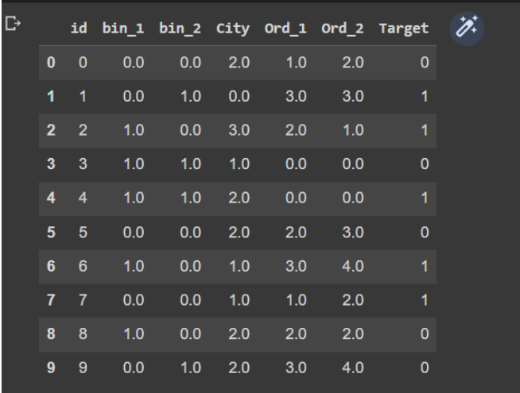
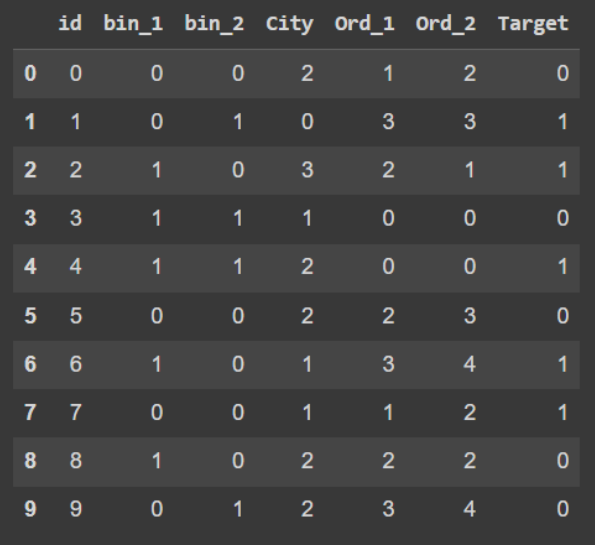
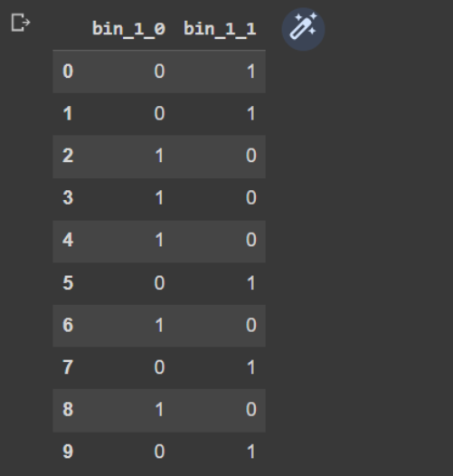
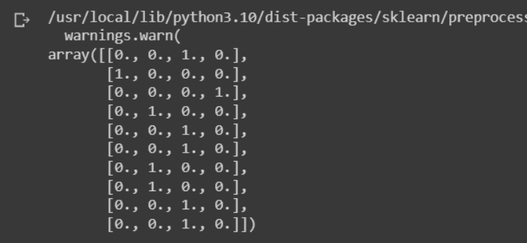
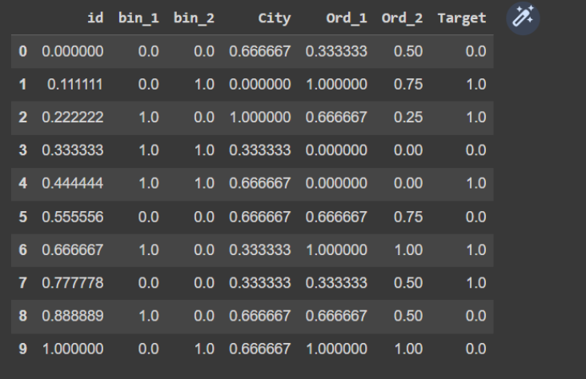
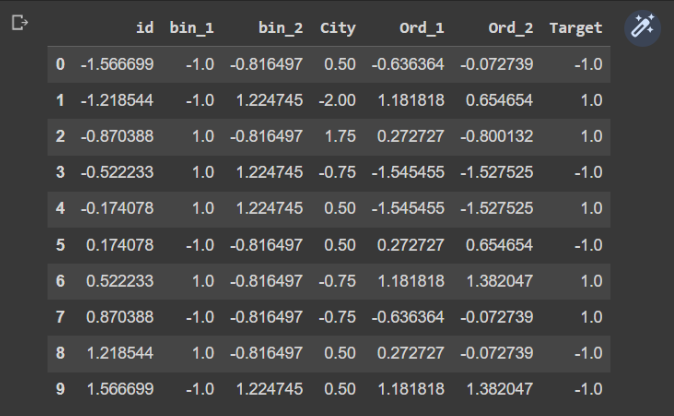
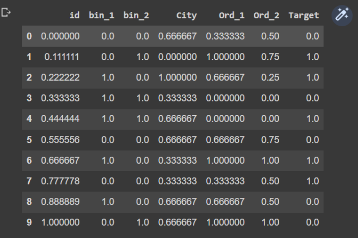
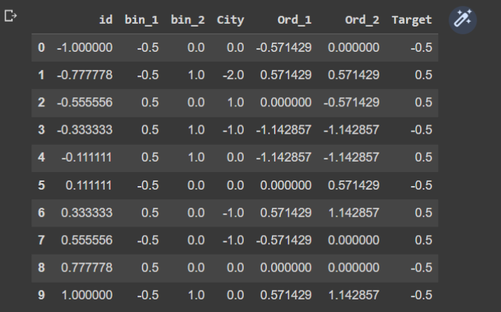
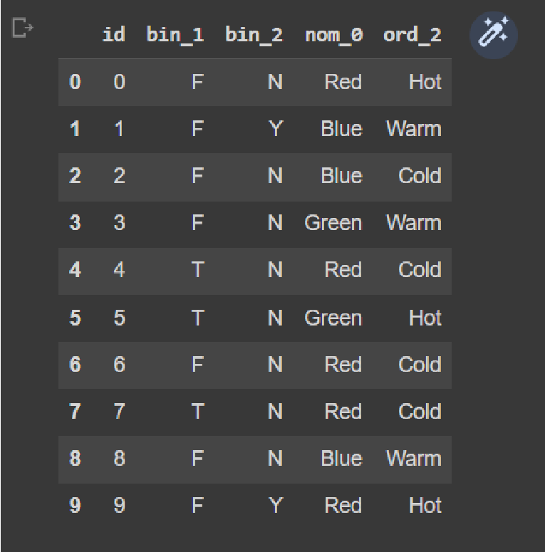
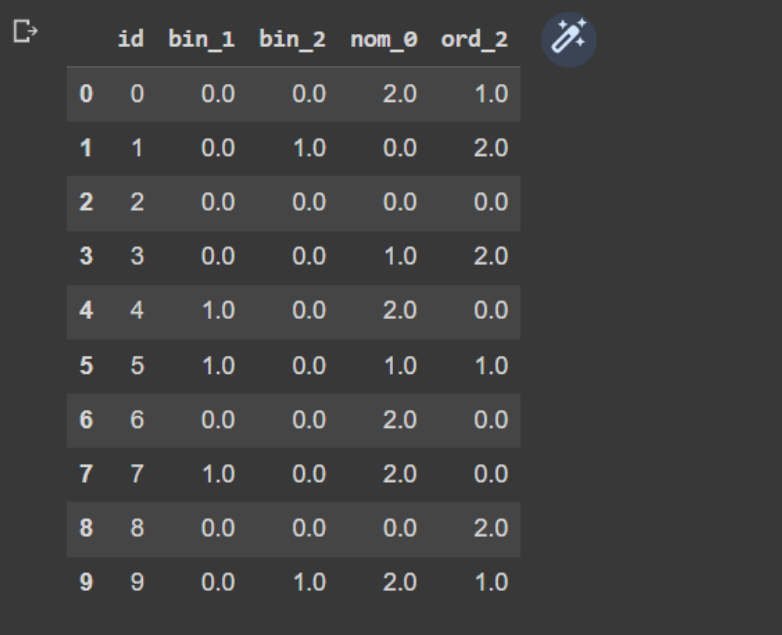
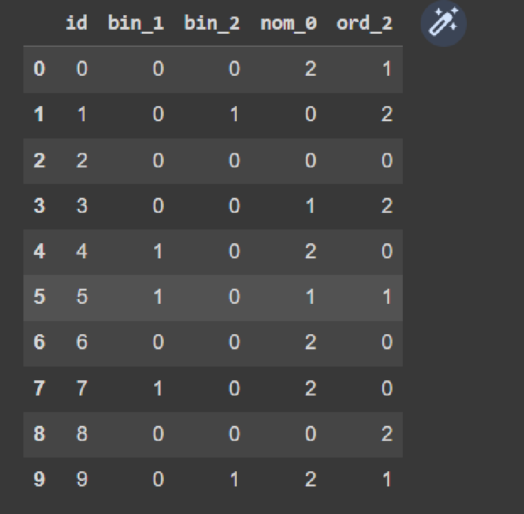
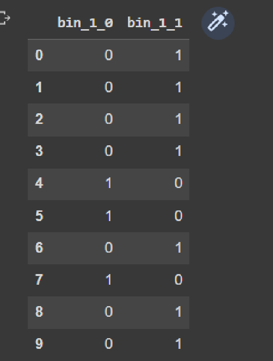
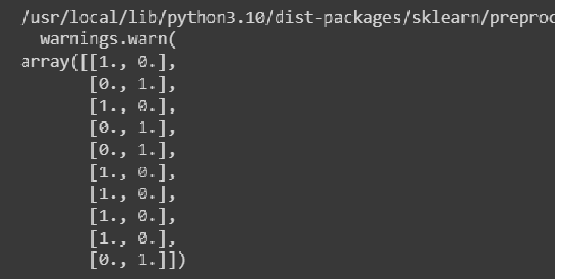
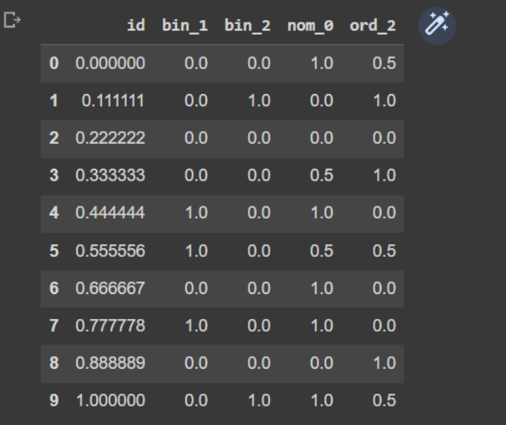
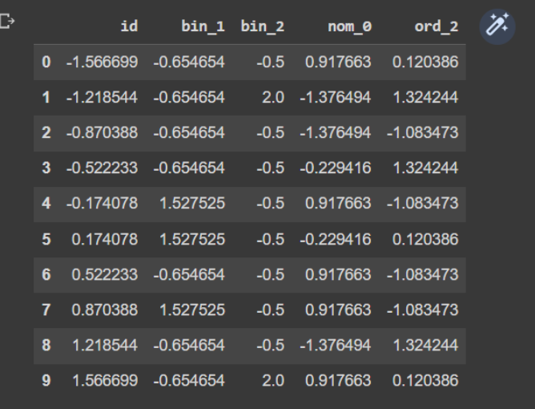
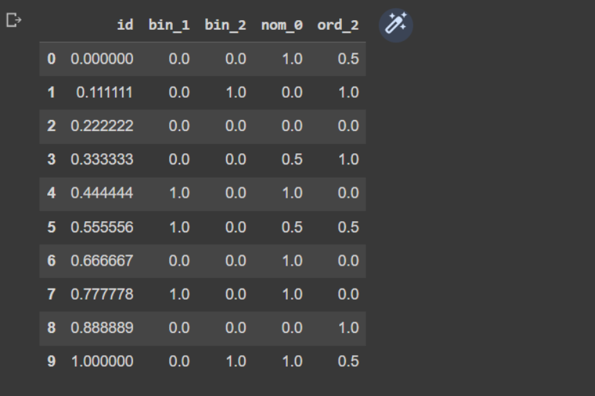
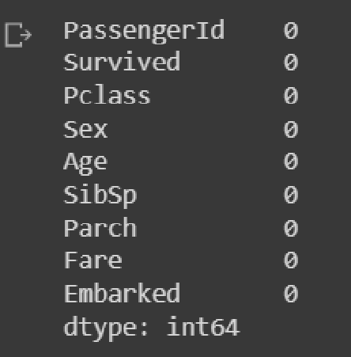
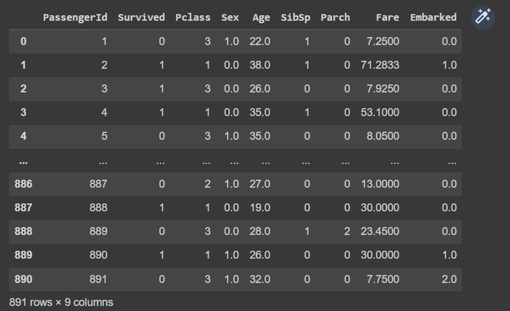
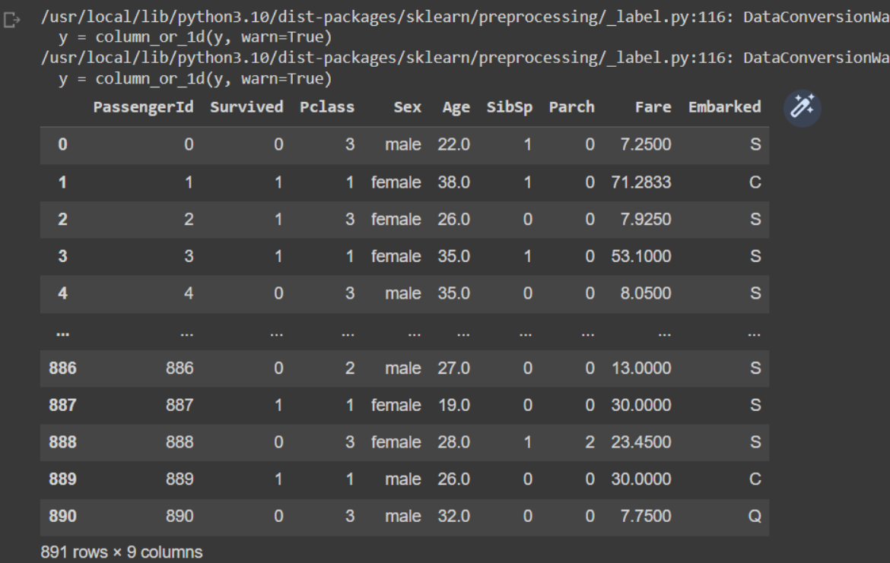
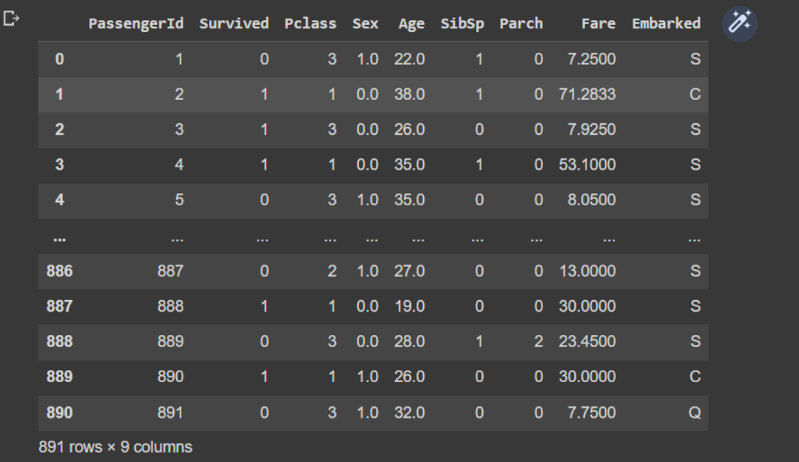
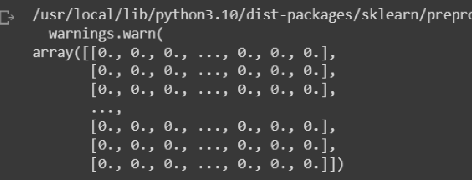
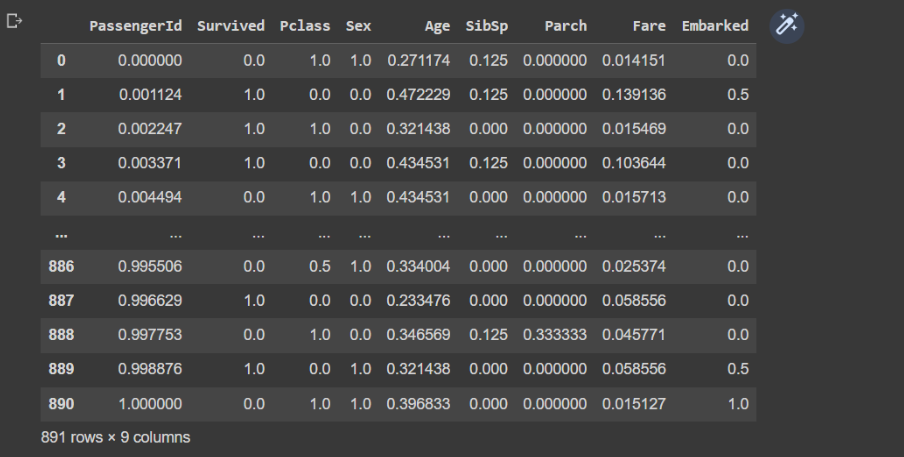

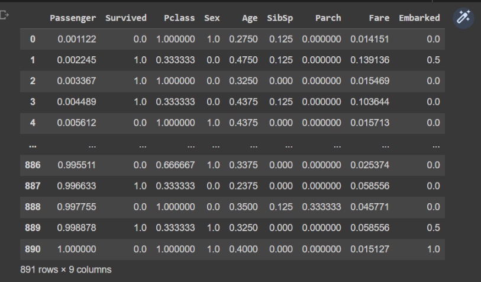
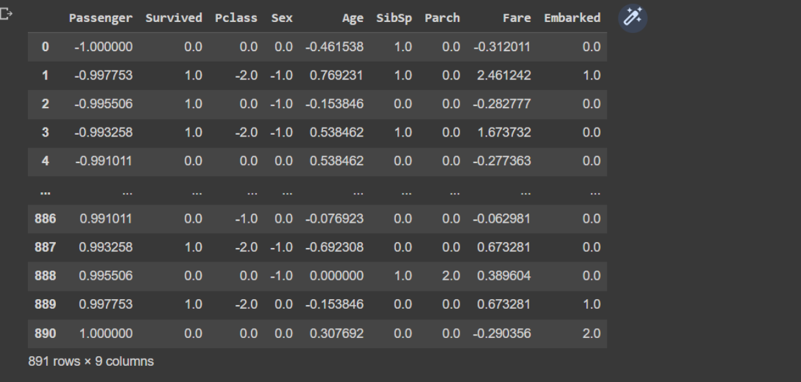


## RESULT 
The output of the Future generation programm is excicuted succssfully

